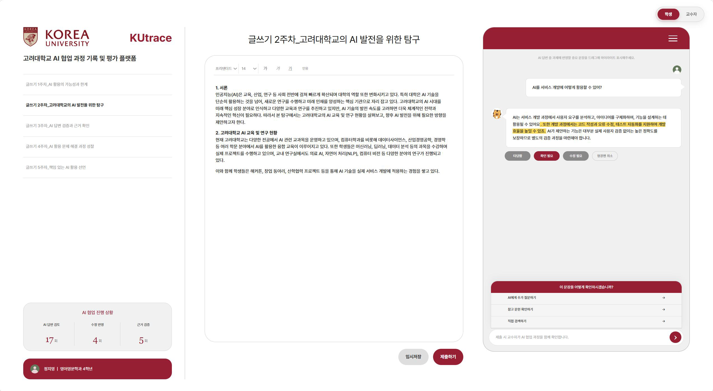
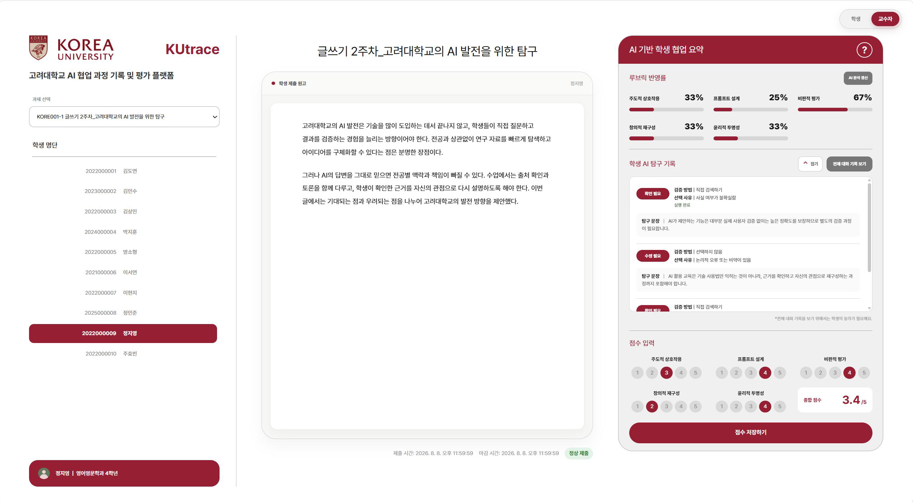
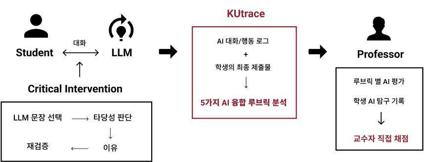

# KUtrace
[https://ku-ai-writing-platform.vercel.app/](https://ku-ai-writing-platform.vercel.app/)

KUtrace는 생성형 AI를 활용한 과제에서 학생의 사고 과정을 기록하는 플랫폼입니다. 학생은 AI 답변을 읽고 판단한 흔적을 남기고, 교수자는 최종 제출물과 그 기록을 함께 보며 평가합니다.

오늘날 생성형 AI는 대학 교육 전반에 빠르게 확산되며 과제 작성, 자료 검색, 코딩 등 다양한 학습 활동에서 활용되고 있습니다. 하지만 현재 대학 과제에서 생성형 AI에 대한 방침은 허용하거나 허용하지 않거나로 이분법적이며, 이는 AI에 사고 과정을 의존하는 **인지적 오프로딩**의 위험을 키울 수 있습니다. 따라서 본 연구는 학생이 AI의 답변을 검토하고 수정하는 과정을 평가에 반영함으로써 AI 협업 과정을 기록하는 KUtrace를 제안하고자 합니다.

## Key Features

### Student

- 한 화면에서 AI와 과제 작성
- AI가 한 답변의 일부를 골라 `타당함`, `확인 필요`, `수정 필요`로 판단
- 각각 추가 질문, 참고 문헌 확인, 직접 검색으로 답변 검증
- 주도적 개입 수준을 인지하도록 AI 답변 검토, 수정 반영, 근거 검증 횟수 등을 표시 및 기록

### Instructor

- 학생별 최종 제출물과 AI 탐구 기록 비교
- AI가 학생의 대화 기록과 데이터를 기반으로 다섯 가지 루브릭 점수 제시
- 학생의 비판적 사고 과정을 확인 후 교수자가 최종 평가

## Workflow



학생의 AI 대화 로그와 최종 제출물을 분석하여 AI 협업 과정을 5가지 루브릭으로 평가하고 리포트를 제공함으로써, 교수자로 하여금 결과물뿐만 아니라 사고 과정 전체를 평가할 수 있도록 돕습니다. 이때, AI 정량 지표는 보조 수단으로 활용되며, 최종 채점은 교수자의 전문적 판단에 의해 수행됩니다.

## Evaluation Rubric

| 평가 항목 | 측정 기준 |
| --- | --- |
| 주도적 상호작용 | AI 대화 중 추가 질문·수정 요청·방향 전환 등 의미 있는 개입이 나타난 비율 |
| 프롬프트 설계 | 목적·맥락·요구사항·제약조건의 네 요소를 충족한 비율 |
| 비판적 평가 | AI 답변에 대해 확인·수정 필요를 판단하고 검증 행동으로 이어진 비율 |
| 창의적 재구성 | 최종 제출물의 관점·논리·언어를 자신의 것으로 재구성한 정도 |
| 윤리적 투명성 | 최종 제출물에서 AI 사용 여부·목적·범위를 공개한 요소의 충족 비율 |

## Architecture

프론트엔드는 학생 화면과 교수자 화면으로 나뉩니다. 두 화면 모두 `app/api.ts`를 통해 Spring API를 호출합니다. 로컬에서는 `http://localhost:4000`, HTTPS 배포 환경에서는 같은 출처의 `/api/*` 경로를 사용합니다.

```text
React 19 + TypeScript
        │
        │ /api/*
        ▼
Spring Boot 3.4
        ├── DatabaseStore ─── MySQL 8.4
        ├── AiService ─────── Groq / Google AI Studio
        └── SearchService ─── SearXNG
```

학생이 메시지를 보내면 서버는 원문을 먼저 저장합니다. 이전 대화는 요약하고 최근 8개 메시지와 합쳐 모델에 전달합니다. 최신 정보나 출처가 필요한 질문은 SearXNG에서 검색한 뒤, 검색 결과를 바탕으로 답변을 생성합니다.

루브릭 분석은 대화, 행동 이벤트, 제출물을 입력으로 사용합니다. 서버가 먼저 로컬 규칙으로 기본 결과를 만들고, 교수가 분석을 실행하면 Google AI Studio 또는 Groq의 결과를 병합합니다. 원자료가 바뀌지 않았다면 저장해 둔 분석 결과를 재사용합니다.

## Tech Stack

| Area | Technology |
| --- | --- |
| Frontend | React 19, TypeScript, vinext, Vite |
| Backend | Java 17, Spring Boot 3.4, Maven |
| Database | MySQL 8.4, Spring JDBC, Flyway |
| Student AI | Groq API |
| Rubric Analysis | Google AI Studio 또는 Groq |
| Search | SearXNG JSON API |
| Infrastructure | Docker Compose, AWS EC2, Cloudflare Tunnel, Vercel |

## Local Development

### Prerequisites

- Node.js `22.14.0 이상 24.0.0 미만` 또는 `24.19.0 이상`
- npm
- Java 17과 Maven
- Docker와 Docker Compose
- AI 기능을 사용할 경우 Groq 또는 Google AI Studio API 키

Node 22 LTS를 권장합니다. Node 24.13.0은 Windows에서 Vite 8 빌드가 비정상 종료될 수 있습니다.

### 1. Install Dependencies

프로젝트 루트에서 패키지를 설치하고 환경 변수 파일을 만듭니다.

Windows PowerShell:

```powershell
npm install
Copy-Item .env.example .env
```

macOS/Linux:

```bash
npm install
cp .env.example .env
```

`.env`에는 필요한 API 키를 입력합니다.

### 2. Start MySQL and SearXNG

```bash
docker compose up -d mysql searxng
docker compose ps
```

| Service | Address |
| --- | --- |
| MySQL | `localhost:3306` |
| SearXNG | `http://localhost:8080` |

로컬 데이터베이스 이름은 `ku_ai_trace`, 사용자와 비밀번호는 각각 `ku_ai`, `ku_ai_local`입니다. 두 포트 모두 로컬호스트에만 열립니다.

### 3. Start the Backend

```bash
npm run api
```

Spring API는 `http://localhost:4000`에서 실행됩니다. 처음 시작할 때는 Flyway가 아직 적용되지 않은 마이그레이션을 실행합니다.

```bash
curl http://localhost:4000/api/health
```

PowerShell에서는 `Invoke-RestMethod http://localhost:4000/api/health`로 확인할 수 있습니다.

### 4. Start the Frontend

새 터미널에서 실행합니다.

```bash
npm run dev
```

브라우저에서 `http://localhost:3000`을 열면 학생 화면과 교수자 화면을 확인할 수 있습니다.

## Environment Variables

전체 예시는 `.env.example`에 있습니다.

| Variable | Description |
| --- | --- |
| `DB_URL` | MySQL JDBC 주소 |
| `DB_USERNAME` | MySQL 사용자 |
| `DB_PASSWORD` | MySQL 비밀번호 |
| `API_PORT` | Spring API 포트 |
| `GROQ_API_KEY` | 학생 AI 대화용 Groq 키 |
| `GROQ_API_KEY_BACKUP` | 기본 Groq 키가 실패했을 때 사용할 예비 키 |
| `STUDENT_MODEL` | 학생 AI 모델 |
| `GOOGLE_API_KEY` | 교수자 분석용 Google AI Studio 키 |
| `PROFESSOR_PROVIDER` | 교수자 분석 모델 타입: `google` 또는 `groq` |
| `PROFESSOR_MODEL` | 교수자 분석 모델 |
| `SEARCH_ENABLED` | SearXNG 검색 사용 여부 |
| `SEARCH_API_URL` | SearXNG JSON API 주소 |

API 키가 없어도 화면과 저장 흐름은 확인할 수 있습니다. 이 경우 학생 대화는 목업 응답을 사용하고 루브릭은 rule base로 계산합니다.

## API

| Method | Endpoint | Description |
| --- | --- | --- |
| `GET` | `/api/health` | 서버, DB, AI 공급자 상태 확인 |
| `GET` | `/api/assignments` | 과제 목록 조회 |
| `GET` | `/api/students` | 과제별 학생 목록 조회 |
| `GET` | `/api/students/{studentId}/summary` | 학생 제출물과 협업 기록 조회 |
| `POST` | `/api/chat` | 학생 메시지 저장 및 AI 답변 생성 |
| `POST` | `/api/events` | 문장 선택, 판단, 검증 행동 저장 |
| `POST` | `/api/drafts` | 임시 저장 |
| `POST` | `/api/submissions` | 최종 제출 및 기본 루브릭 계산 |
| `POST` | `/api/evaluations/{studentId}/run` | 교수자용 루브릭 분석 실행 |
| `POST` | `/api/reviews/{reviewId}/resolve` | 교수 확인 필요 항목 확정 |
| `POST` | `/api/scores` | 교수자 점수 저장 |

## Data

대화 원문은 `ai_interactions`, 학생의 판단과 검증 행동은 `ai_events`에 저장합니다. 임시 저장과 최종 제출은 `submissions`에 이력으로 쌓이고, 루브릭 분석은 당시의 근거와 함께 `rubric_evaluations`에 JSON 스냅샷으로 남습니다. 교수자가 입력한 점수는 `professor_scores`에서 별도로 관리합니다.

테이블 관계와 마이그레이션 설명은 [backend/DATABASE.md](backend/DATABASE.md)에서 확인할 수 있습니다.

대화 원문과 요약만 초기화하려면 MySQL에 접속해 아래 쿼리를 실행합니다.

```sql
START TRANSACTION;
DELETE FROM conversation_summaries;
DELETE FROM ai_interactions;
COMMIT;
```

학생 정보, 제출물, 평가 결과는 그대로 남습니다.

## Verification

```bash
npm run lint
npm test
npm run api:build
```

Windows에서 `npm.ps1` 실행 정책 오류가 발생하면 `npm.cmd`로 같은 명령을 실행합니다.

## Limitations

- 현재는 시연용 프로토타입으로 별도의 로그인과 권한 관리 기능이 없습니다.
- 루브릭 자체에 대한 생성형 AI 사용을 통제할 방법을 마련할 필요가 있습니다.

## Team

- 김상민 — 고려대학교 국어국문학과
- 정지영 — 고려대학교 영어영문학과
- 주효빈 — 고려대학교 영어영문학과
