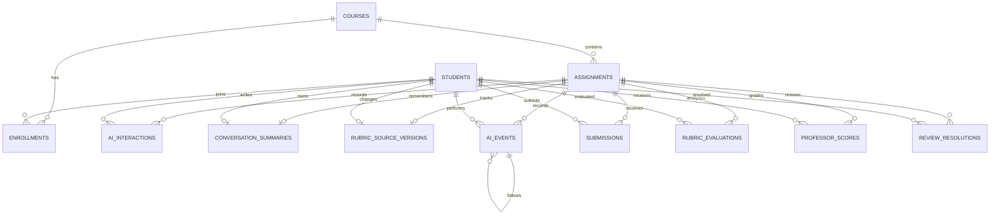

# MySQL 데이터베이스 설계

## 설계 원칙

1. 학생의 원본 행동 기록은 수정하지 않고 시간순으로 누적합니다.
2. 임시 저장, 최종 제출, 루브릭 평가는 새 행을 추가해 이력을 남깁니다.
3. 교수 점수는 현재 값 한 건을 유지하되, AI가 자동 입력하지 않습니다.
4. 루브릭 분석의 비율뿐 아니라 근거와 `needs_review` 항목을 JSON 스냅샷으로 보존합니다.
5. 모든 학생 기록은 `assignment_id`와 `student_id`를 함께 사용해 과제별로 분리합니다.
6. 대화 원문은 계속 보존하고, AI에게 전달할 이전 맥락은 별도 요약으로 갱신합니다.
7. 루브릭 스냅샷은 원자료가 바뀔 때만 다시 계산해, 교수자 조회만으로 AI 비용이 발생하지 않게 합니다.

## 관계도

## 테이블별 책임

### `courses`

과목 코드와 이름을 저장합니다. `code`는 중복될 수 없습니다.

### `assignments`

과제 제목, 설명, 마감 시각을 저장하고 `courses`에 연결됩니다. 현재 기본 과제 ID는 `1`이며 `ASSIGNMENT_ID` 환경 변수로 바꿀 수 있습니다.

### `students`, `enrollments`

학생 기본 정보와 수강 관계를 분리합니다. 한 학생이 여러 과목을 수강할 수 있고 한 과목에 여러 학생이 포함될 수 있습니다.

### `ai_interactions`

학생 메시지와 AI 답변을 한 테이블에 시간순으로 저장합니다.

- `role`: `user` 또는 `ai`
- `content`: 메시지 원문
- `sources_json`: Groq 브라우저 검색이 반환한 출처 제목·URL 목록
- `created_at`: 상호작용 시각

주도적 상호작용과 프롬프트 설계 분석의 원자료입니다.

### `conversation_summaries`

학생·과제마다 한 행을 유지하는 AI 대화 맥락 요약입니다. `ai_interactions`의 원문을 지우거나 대체하지 않습니다.

- `summary`: 이전 대화에서 유지해야 할 목표, 조건, 결정, 검증 과제, 미해결 질문의 압축본
- `summarized_interaction_count`: 이 요약에 이미 반영한 원문 메시지 수
- `updated_at`: 마지막 요약 갱신 시각

학생이 새 메시지를 보내면 Spring은 이 요약과 최근 16개 대화만 Groq에 전달합니다. 16개보다 오래된 메시지가 생기면 즉시 요약에 반영하며, API 키가 없을 때도 같은 구조로 서버 내 축약본을 저장합니다.

### `ai_events`

AI 답변에 대한 학생의 후속 행동을 이벤트로 누적합니다.

- `type`: `highlight`, `verdict`, `followup` 등
- `response_id`: 대상 AI 답변
- `highlighted_text`: 선택한 문장
- `verdict`: 타당함/확인 필요/수정 필요에 대응하는 값
- `reason`: 선택 이유
- `method`: AI에게 추가 질문, 참고 문헌 확인, 직접 검색
- `parent_event_id`: 후속 행동이 연결된 기존 이벤트
- `executed`: 검증 방법을 실제 실행했는지 여부

비판적 평가와 학생 AI 탐구 기록 카드의 원자료입니다.

### `submissions`

`draft`와 `submitted`를 모두 새 행으로 추가합니다. 가장 큰 `id`가 현재 화면에 표시되는 최신 버전이며 이전 내용은 이력으로 남습니다.

### `rubric_evaluations`

분석 당시 결과 전체를 `result_json`에 저장합니다. JSON에는 각 루브릭의 충족 수, 분모, 반영률, 근거, 교수 확인 필요 항목이 포함됩니다. 나중에 분석 프롬프트나 모델이 바뀌어도 과거 결과를 재현할 수 있도록 스냅샷으로 누적합니다.

### `rubric_source_versions`

학생별 루브릭 원자료의 변경 횟수입니다. 대화 저장, 하이라이트·판단·검증 버튼, 임시 저장·제출, 교수 확인 필요 항목 확정이 발생할 때만 증가합니다. 평가 스냅샷의 `sourceVersion`과 현재 값이 같으면 저장된 비율을 그대로 반환합니다. 따라서 교수자 화면에서 학생을 선택하거나 새로고침해도 Groq를 다시 호출하지 않습니다.

### `professor_scores`

과제와 학생 조합당 한 행을 유지합니다. 다섯 루브릭 점수는 각각 `1~5` 또는 미입력 `NULL`이며, Spring API의 upsert로 현재 점수를 갱신합니다. 이 값은 루브릭 반영률과 별개이고 교수만 입력합니다.

### `review_resolutions`

AI가 애매하다고 판단한 루브릭 근거에 대해 교수가 `fulfilled` 또는 `not_fulfilled`로 확정한 이력을 누적합니다. 동일한 `review_id`가 여러 번 확정되면 가장 최근 행이 현재 판단입니다.

## 마이그레이션

- `V1__create_schema.sql`: 테이블, 외래 키, 검사 제약, 조회 인덱스
- `V2__seed_demo_data.sql`: 화면 확인용 과제, 학생 10명과 기준 학생 기록
- `V3__seed_remaining_student_records.sql`: 교수자 명단의 나머지 9명 대화·이벤트·제출 기록
- `V4__add_conversation_summaries.sql`: AI 대화 맥락 요약 테이블
- `V5__add_rubric_source_versions.sql`: 루브릭 비율 캐시 무효화용 원자료 버전
- `V6__differentiate_demo_student_records.sql`: 학생 10명의 서로 다른 데모 협업 기록과 제출물
- `V7__add_ai_interaction_sources.sql`: AI 답변의 검색 근거 링크 저장 컬럼

Spring 시작 시 Flyway가 `flyway_schema_history`를 확인하고 적용하지 않은 버전만 순서대로 실행합니다. 이미 적용한 SQL 파일은 수정하지 않고, 변경이 필요하면 `V3__...sql`처럼 새 마이그레이션을 추가해야 합니다.

## 향후 Azure 연결

Azure Database for MySQL을 만들면 코드 변경 없이 `DB_URL`, `DB_USERNAME`, `DB_PASSWORD`만 교체할 수 있습니다. Azure 연결 시에는 JDBC URL에서 TLS를 활성화하고 비밀번호를 소스 코드나 `.env`에 커밋하지 않아야 합니다.
